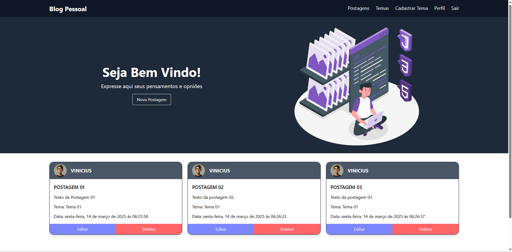

# 📝 **Front-End para Blog Pessoal**

Este projeto é a interface front-end para um blog pessoal, desenvolvido com **React**, **TypeScript**, **Vite** e **Tailwind CSS**. Ele permite a criação, edição e gerenciamento de postagens e temas.

---

## 🚀 **Funcionalidades**

- CRUD de postagens (criar, ler, atualizar e deletar artigos).
- CRUD de temas para categorização dos posts.
- Sistema de autenticação e gerenciamento de perfil.
- Navegação intuitiva com Navbar e Footer responsivos.
- Estado global gerenciado com **useContext**.

---

## 🛠️ **Tecnologias Utilizadas**

- **React**: Biblioteca para construção da interface do usuário.
- **TypeScript**: Tipagem estática para maior segurança no código.
- **Vite**: Ferramenta para build rápido e eficiente.
- **Tailwind CSS**: Framework para estilização rápida e responsiva.

---

## 🔧 **Como Configurar o Projeto**




1. Clone este repositório:
   ```bash
   git clone https://github.com/Vinicius-Rodriguess/personal-blog-frontend.git
   cd personal-blog-frontend
   ```

2. Instale as dependências:
   ```bash
   yarn
   ```

3. Inicie o servidor de desenvolvimento:
   ```bash
   yarn dev
   ```

4. Acesse a aplicação no navegador em `http://localhost:5173`

---

## 🖥️ **Exemplo de Uso**

1. **Criar e gerenciar postagens**: Acesse a página principal e adicione novas postagens.
2. **Editar perfil**: Modifique suas informações na página de perfil.
3. **Organizar postagens por temas**: Adicione e gerencie temas para categorizar os artigos.
4. **Experiência responsiva**: Navegue entre as seções com Navbar e Footer dinâmicos.

---

## 📌 **Limitações**

- Requer back-end para persistência de dados.
- O servidor precisa estar rodando para acesso completo às funcionalidades.

---

## ✅ **Melhorias Futuras**

- Implementação de um editor de texto mais avançado.
- Adicionar modo escuro para melhor acessibilidade.
- Integração com serviços de comentários.

---

## 👨‍💻 **Autor**

**Vinicius Rodrigues**

- GitHub: [Vinicius-Rodriguess](https://github.com/Vinicius-Rodriguess)
- Email: rodrigues.vini.2004@gmail.com